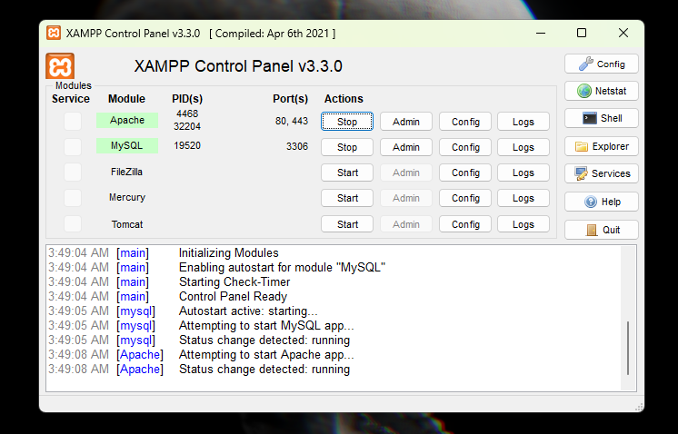
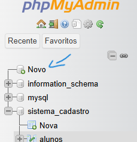
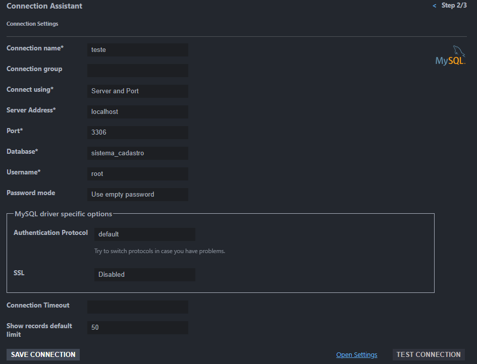
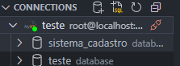

# Documentação de Software: Sistema de Cadastro de Alunos

## 1 - Visao Geral do Software

  O Software de Cadastro de Alunos foi construido sob um ambiente web em um servidor Apache, desenvolvido em PHP, e estruturado em HTML e CSS. Sua finalidade é o cadastro de alunos de qualquer tipo instituição de ensino, desde escolas, universidades ou qualquer  vertente na área. Com campos preenchíveis para dados pessoais do aluno, para documentação do mesmo na instituição.

## 2 - Requisitos

- **Sistema Operacional**: Windows
- **Navegador**: Chrome, Firefox, Edge
- **Versão PHP**: v8.0 ou superior
- **Servidor Web**: Xampp v3.3.0 (MySql, Apache inclusos)
- **Ambiente de Desenvolvimento**: Qualquer um compatível com os requisitos listados acima

## **3 - Arquitetura do Sistema**

A arquitetura do sistema segue o padrão **MVC (Model-View-Controller)**, onde:

- **Model**: Representa os dados e regras de negócios, com a interação com o banco de dados (MySql).
- **View**: Interface do usuário, construída utilizando HTML, CSS e PHP.
- **Controller**: Processa as entradas do usuário, atualiza o modelo e retorna as respostas para a view.

O sistema foi desenvolvido utilizando as tecnologias:

- **Backend**: PHP e Xampp
- **Frontend**: HTML, CSS e PHP
- **Banco de Dados**: MySql

## **4 - Como instalar?**

 Clone o repositório na sua máquina.

```bash
git clone https://github.com/Astrinn/sistema-de-cadastro-trabalho
```

Baixe o Xampp

### Usando o **curl**:

1. Abra o **Prompt de Comando** (CMD) no Windows.
2. Execute o comando para baixar o XAMPP (exemplo de versão):
    
    ```bash
    curl -L -o xampp-installer.exe https://www.apachefriends.org/xampp-files/8.1.6/xampp-windows-x64-8.1.6-0-VC15-installer.exe
    ```
    

### Usando o **wget**:

1. Caso tenha o **wget** instalado, use o comando abaixo:

```bash
wget https://www.apachefriends.org/xampp-files/8.1.6/xampp-windows-x64-8.1.6-0-VC15-installer.exe
```

## 5.1- Configurar Banco de Dados

Execute o Xammp e siga os passos da instalação (Obs: Não se esqueça de autorizar os recursos do Apache e do MySql).

Ao abri-lo inicie o servidor Apache e MySql, desta maneira:



Caso ao iniciar o servidor MySql um erro surja, certifique-se que não há nenhum outro processo em andamento na sua máquina que esteja utilizando as portas de rede :3306 ou :3307. Para remediar basta encerrar o processo por meio do Gerenciador de Tarefas. Se o erro persistir, ou outro erro aparecer, procure ajuda no forum da comunidade do Xampp, segue o link: [Apache Friends Support Forum - Index page](https://community.apachefriends.org/f/).

### 5.2 - phpMyAdmin

Apos a configuração do Xampp, abra o navegador de sua preferencia e digite na barra de URL:

```bash
//localhost/phpMyAdmin/
```

PhpMyAdmin é um serviço instalado juntamente ao Xampp, ele é responsável por toda configuração do banco de dados MySql. E é nele que faremos nossa conexão entre código e DB.

Agora para criar o Banco de Dados basta seguir esse passo a passo:



De um nome ao seu banco e em seguida crie as colunas com cada campo que armazenaram as informções inseridas pelos usuários (nome, rg, cpf, cep,etc). Crie tambem uma coluna chamada Id, para podermos fazer buscas mais rápidas pela tabela, apenas usando o id das colunas. Selecione o tipo de cada coluna de acordo com o valor a ser recebido por ela. E tambem ative o AUTO_INCREMENT para a coluna Id.

Assim seu DB esta praticamente configurado, agora vamos conecta-lo ao seu ambiente de desenvolvimento.

## 6.1 - Ambiente de Desenvolvimento

Nesta documentação usaremos o editor de texto Visual Studio Code. 

### 6.2 - Dependencias VisualStudio Code

- Extensão PHP Intellisense
- Extensão SQLTolls
- Extensão SQLTools MySql

### 6.3 - Conexão com o Banco de Dados

Configure seu painel de conexão com os seus dados.



Para certificar que a conexão com seu DB esteja online, esta janela precisa aparecer:



Agora seu banco de dados esta totalmente conectado e pronto para ser manipulado em seu código.

## 7 - Desenvolvimento do Software

### 7.1 - Estrutura de Arquivos

```bash
/sistema_cadastro
|-- index.php
|-- config.php
|-- style.css
```

### 7.2 - Configuração da Conexão de Banco de Dados (***config**.php*)

```php
<?php
    $servername = "localhost";
    $username = "root";
    $password = "";
    $dbname = "sistema_cadastro";

    $conn = new mysqli($servername, $username, $password, $dbname);     

    if ($conn->connect_error) {
        die("Falha na Conexao ao DB...". $conn->connect_error);
    }
?>
```

### 7.3 - Cadastro do Usuário (*index.php*)

- Configuração da Interação do DB com o HTML

```php
<?php
// Inclui o arquivo de configuração para conectar ao banco de dados
include('config.php');

// Inicializa a variável de erro e sucesso
$mensagem = "";

if ($_SERVER['REQUEST_METHOD'] == 'POST') {
    // Recebe os dados do formulário
    $nome = $_POST['nome'];
    $rg = $_POST['rg'];
    $cpf = $_POST['cpf'];
    $cep = $_POST['cep'];

    // Insere os dados no banco de dados
    $sql = $conn->prepare("INSERT INTO alunos (nome, rg, cpf, cep) VALUES (?, ?, ?, ?)");
    $sql->bind_param("ssss", $nome, $rg, $cpf, $cep);

    // Verifica se a execução foi bem-sucedida
    if ($sql->execute()) {
        $mensagem = "Aluno cadastrado com sucesso!";
    } else {
        $mensagem = "Erro ao cadastrar aluno: " . $sql->error;
    }

    // Fecha a conexão preparada
    $sql->close();
}
?>
```

- Configuração HTML

```html
<!DOCTYPE html>
<html lang="pt-br">
<head>
    <meta charset="UTF-8">
    <meta name="viewport" content="width=device-width, initial-scale=1.0">
    <title>Cadastro de Alunos</title>
    <style>
        /* Centralizar o conteúdo */
        body {
            display: flex;
            flex-direction: column;  /* Organiza os elementos em coluna */
            justify-content: center;
            align-items: center;
            height: 100vh;
            margin: 0;
        }

        h2 {
            margin-bottom: 20px;  /* Espaçamento entre o título e o formulário */
        }

        form {
            display: flex;
            flex-direction: column;
            align-items: flex-start;
            padding: 20px;
            border: 1px solid #ccc;
            border-radius: 5px;
            width: 300px;
        }

        label {
            margin-bottom: 5px;
        }

        input {
            margin-bottom: 10px;
            padding: 8px;
            width: 100%;
            border: 1px solid #ccc;
            border-radius: 5px;
        }

        button {
            padding: 10px 20px;
            background-color: #4CAF50;
            color: white;
            border: none;
            border-radius: 5px;
            cursor: pointer;
        }

        button:hover {
            background-color: #45a049;
        }

        .mensagem {
            margin-top: 10px;
            color: green;  /* Cor da mensagem de sucesso */
        }

        .erro {
            color: red;  /* Cor da mensagem de erro */
        }
    </style>
</head>
<body>

    <h2>Cadastro de Aluno</h2>

    <form method="POST" action="">
        <label for="nome">Nome:</label>
        <input type="text" id="nome" name="nome" required><br><br>

        <label for="rg">RG:</label>
        <input type="text" id="rg" name="rg" required><br><br>

        <label for="cpf">CPF:</label>
        <input type="text" id="cpf" name="cpf" required><br><br>

        <label for="cep">CEP:</label>
        <input type="text" id="cep" name="cep" required><br><br>

        <button type="submit">Cadastrar</button>
    </form>
</body>
</html>
```

### 7.4 - Configuração CSS (*style.css*)

```css
#container{
    display: flexbox;
    justify-content: space-between;
    align-items: center;

    top: 200px;
    bottom: 200px;
    left: 200px;
    right: 200px;
}
```

## 8 - Conclusão

Este documento fornece um guia básico para configuração e execução da aplicação. Certifique-se de configurar corretamente o ambiente para evitar erros de conexão ao banco de dados.

## 9 -Trabalho Acadêmico

Este trabalho foi desenvolvido para a disciplina de Engenharia de Software, ministrada pelo professor Felipe, na Faculdade de Ciências da Computação. Aluno responsável: Hiago Duarte.
